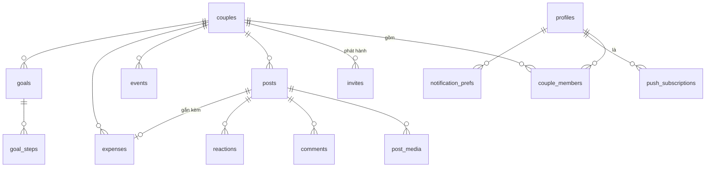

# Thiết kế Database (Supabase / PostgreSQL)

Tài liệu này là **thiết kế đầy đủ + SQL chạy được ngay** cho phạm vi MVP, đồng thời chừa sẵn chỗ cho các tính năng ở giai đoạn sau.

## Cách dùng file này

1. Tạo project trên [supabase.com](https://supabase.com) (gói miễn phí là quá đủ cho 2 người dùng).
2. Vào **SQL Editor** → dán từng phần từ mục 4 trở đi theo đúng thứ tự → Run.
3. Tạo Storage bucket theo mục 11.

Chạy theo thứ tự là quan trọng, vì các bảng tham chiếu lẫn nhau.

---

## 1. Nguyên tắc thiết kế

Bốn quy tắc chi phối toàn bộ schema:

**1. Mọi thứ thuộc về `couple`, không thuộc về `user`.**
Mỗi bảng dữ liệu đều mang cột `couple_id`. Kể cả những bảng con như `comments` hay `post_media` — về lý thuyết có thể suy ra `couple_id` qua bảng cha, nhưng lưu trực tiếp giúp câu lệnh phân quyền đơn giản và nhanh hơn nhiều.

**2. Bảo mật đặt ở tầng database (RLS), không đặt ở app.**
Row-Level Security nghĩa là Postgres tự chặn: dù app có viết sai câu query, người dùng cũng **không thể** đọc dữ liệu của cặp đôi khác. Đây là lý do lớn nhất chọn Supabase thay vì tự viết API — bạn không phải nhớ kiểm tra quyền ở từng chỗ.

**3. Không xoá cứng.**
Mọi bảng nội dung có cột `deleted_at`. Xoá = ghi thời điểm xoá. Lỡ tay xoá mất kỉ niệm là chuyện không sửa được, và khi chia tay cũng cần dữ liệu còn nguyên để xuất ra.

**4. Tiền là số nguyên.**
Lưu bằng `bigint`, đơn vị **đồng** (không có phần thập phân). Không bao giờ dùng `float` cho tiền — sai số tích luỹ làm lệch mọi thống kê.

## 2. Sơ đồ quan hệ



## 3. Danh sách bảng

| Bảng | Vai trò | Giai đoạn |
|---|---|---|
| `profiles` | Hồ sơ người dùng, nối với `auth.users` của Supabase | MVP |
| `couples` | **Bảng gốc.** Một "không gian" của một cặp đôi | MVP |
| `couple_members` | Ai thuộc space nào, biệt danh trong space | MVP |
| `invites` | Mã mời 6 ký tự để ghép đôi | MVP |
| `posts` | Bài kỉ niệm trên timeline | MVP |
| `post_media` | Ảnh/video của bài | MVP |
| `reactions` | Thả tim / biểu cảm | MVP |
| `comments` | Bình luận | MVP |
| `events` | Sự kiện & nhắc nhở | MVP |
| `expenses` | Khoản chi tiêu | MVP |
| `goals` | Mục tiêu chung | MVP |
| `goal_steps` | Các bước con của mục tiêu | MVP |
| `push_subscriptions` | Đăng ký Web Push của từng máy | MVP |
| `notification_prefs` | Cài đặt bật/tắt từng loại thông báo | MVP |
| `letters` | Thư gửi tương lai | Sau |
| `daily_answers` | Câu hỏi mỗi ngày | Sau |
| `mood_checkins` | Check-in tâm trạng | Sau |

---

## 4. Nền móng & bảng người dùng

```sql
-- ============================================================
-- PHẦN 1: NỀN MÓNG
-- ============================================================

create extension if not exists pgcrypto;

-- Hàm dùng chung: tự cập nhật updated_at mỗi khi sửa dòng
create or replace function public.touch_updated_at()
returns trigger language plpgsql as $$
begin
  new.updated_at = now();
  return new;
end;
$$;


-- ------------------------------------------------------------
-- profiles: hồ sơ người dùng
-- Supabase đã có sẵn bảng auth.users (email, mật khẩu, OTP...).
-- Ta không sửa bảng đó, mà tạo bảng riêng cho thông tin hiển thị.
-- ------------------------------------------------------------
create table public.profiles (
  id           uuid primary key references auth.users(id) on delete cascade,
  display_name text,
  avatar_url   text,
  timezone     text not null default 'Asia/Ho_Chi_Minh',  -- để tính ngày kỉ niệm đúng
  created_at   timestamptz not null default now(),
  updated_at   timestamptz not null default now()
);

create trigger profiles_touch
  before update on public.profiles
  for each row execute function public.touch_updated_at();

-- Khi có người đăng ký, tự tạo profile tương ứng
create or replace function public.handle_new_user()
returns trigger language plpgsql security definer set search_path = public as $$
begin
  insert into public.profiles (id, display_name)
  values (new.id, split_part(new.email, '@', 1))
  on conflict (id) do nothing;
  return new;
end;
$$;

create trigger on_auth_user_created
  after insert on auth.users
  for each row execute function public.handle_new_user();
```

**Tường trang cá nhân** (không phải Timeline): `profile_statuses` — bài “Bạn đang nghĩ gì?”;
`partner_notes` — một ghi chú của A về B (unique theo cặp author/about). Chi tiết SQL:
`app/supabase/migrations/20261003120000_profile_wall.sql`.

## 5. Không gian đôi (couples)

```sql
-- ============================================================
-- PHẦN 2: KHÔNG GIAN ĐÔI
-- ============================================================

create table public.couples (
  id             uuid primary key default gen_random_uuid(),
  start_date     date not null,          -- ngày bắt đầu yêu. KIỂU date, KHÔNG phải timestamp!
  cover_url      text,
  theme          text not null default 'rose',
  timezone       text not null default 'Asia/Ho_Chi_Minh',
  status         text not null default 'active'
                 check (status in ('pending', 'active', 'archived')),
  -- pending  = mới tạo, chờ người thứ hai
  -- active   = đủ hai người
  -- archived = đã huỷ ghép đôi, chỉ còn đọc
  created_by     uuid not null references public.profiles(id),
  created_at     timestamptz not null default now(),
  updated_at     timestamptz not null default now(),
  archived_at    timestamptz,
  deleted_at     timestamptz
);

create trigger couples_touch
  before update on public.couples
  for each row execute function public.touch_updated_at();


-- ------------------------------------------------------------
-- couple_members: ai thuộc space nào
-- Dùng bảng riêng (thay vì 2 cột user_a/user_b trong couples) là
-- quyết định quan trọng nhất của schema này — nhờ nó mà sau
-- này mở rộng, đổi người, xử lý chia tay đều không phải đập đi.
-- ------------------------------------------------------------
create table public.couple_members (
  id         uuid primary key default gen_random_uuid(),
  couple_id  uuid not null references public.couples(id) on delete cascade,
  user_id    uuid not null references public.profiles(id) on delete cascade,
  nickname   text,                      -- người kia gọi mình là gì trong space này
  joined_at  timestamptz not null default now(),
  left_at    timestamptz,
  unique (couple_id, user_id)
);

-- Mỗi người chỉ ở trong ĐÚNG MỘT space đang hoạt động
-- (index này kiêm luôn việc tra cứu theo user_id, không cần index thường)
create unique index one_active_couple_per_user
  on public.couple_members (user_id)
  where left_at is null;


-- ------------------------------------------------------------
-- invites: mã mời ghép đôi
-- ------------------------------------------------------------
create table public.invites (
  id         uuid primary key default gen_random_uuid(),
  couple_id  uuid not null references public.couples(id) on delete cascade,
  code       text not null unique,
  created_by uuid not null references public.profiles(id),
  expires_at timestamptz not null default (now() + interval '7 days'),
  used_at    timestamptz,
  used_by    uuid references public.profiles(id),
  created_at timestamptz not null default now()
);

create index on public.invites (code) where used_at is null;
```

## 6. Hàm phân quyền (quan trọng nhất)

Toàn bộ bảo mật của app xoay quanh hai hàm này. Đọc kỹ phần này.

```sql
-- ============================================================
-- PHẦN 3: HÀM PHÂN QUYỀN
-- ============================================================

-- "Người đang đăng nhập có thuộc space này không?"
--
-- security definer: hàm chạy với quyền của người tạo hàm, nên nó
-- đọc được couple_members mà KHÔNG kích hoạt lại RLS của chính
-- bảng đó. Không có nó sẽ bị đệ quy vô hạn.
create or replace function public.is_member_of(p_couple_id uuid)
returns boolean
language sql stable security definer set search_path = public as $$
  select exists (
    select 1 from public.couple_members m
    where m.couple_id = p_couple_id
      and m.user_id  = auth.uid()
      and m.left_at is null
  );
$$;

-- "Có được GHI vào space này không?"
-- Khác hàm trên ở chỗ: space đã archive (chia tay) thì chỉ đọc.
create or replace function public.can_write_to(p_couple_id uuid)
returns boolean
language sql stable security definer set search_path = public as $$
  select exists (
    select 1
    from public.couple_members m
    join public.couples c on c.id = m.couple_id
    where m.couple_id = p_couple_id
      and m.user_id   = auth.uid()
      and m.left_at   is null
      and c.status    in ('pending', 'active')
      and c.deleted_at is null
  );
$$;

-- Tiện ích: lấy space đang hoạt động của người đang đăng nhập
create or replace function public.my_couple_id()
returns uuid
language sql stable security definer set search_path = public as $$
  select m.couple_id from public.couple_members m
  where m.user_id = auth.uid() and m.left_at is null
  limit 1;
$$;
```

**Từ đây trở đi, mọi policy đều chỉ là:** `using (is_member_of(couple_id))` để đọc và `with check (can_write_to(couple_id))` để ghi. Đơn giản một cách có chủ đích — càng đơn giản càng khó sai.

## 7. Nội dung: kỉ niệm, tương tác

### Đơn vị hành chính (34 tỉnh + ~3321 xã/phường)

Bảng danh mục dùng chung (không theo `couple_id`). Seed từ atlas sáp nhập 2025
(CC-BY-NC). Client chỉ `SELECT`. Polygon vẽ map nằm ở file GeoJSON
(`app/src/lib/geo/`), join bằng `code`.

```sql
create table public.admin_units (
  id          uuid primary key,
  code        text not null unique,
  name        text not null,
  level       text not null check (level in ('province', 'commune')),
  kind        text,
  parent_id   uuid references public.admin_units(id),
  zone        text check (zone is null or zone in ('bac', 'trung', 'nam')),
  merged_from text,
  lat         double precision,
  lng         double precision,
  sort_order  int not null default 0,
  check (
    (level = 'province' and parent_id is null)
    or (level = 'commune' and parent_id is not null)
  )
);
-- posts.admin_unit_id → admin_units(id)  (đơn vị cụ thể nhất đã chọn)
```

```sql
-- ============================================================
-- PHẦN 4: KỈ NIỆM
-- ============================================================

create table public.posts (
  id            uuid primary key default gen_random_uuid(),
  couple_id     uuid not null references public.couples(id) on delete cascade,
  author_id     uuid not null references public.profiles(id),
  caption       text,
  happened_on   date not null default current_date,   -- ngày xảy ra, không phải ngày đăng
  place_name    text,
  place_lat     double precision,   -- chừa sẵn cho "Bản đồ dấu chân"
  place_lng     double precision,
  activity      text,               -- 'food' | 'cafe' | 'travel' | 'movie' | 'home' | ...
  visibility    text not null default 'shared'
                check (visibility in ('shared', 'private')),
  -- MVP luôn dùng 'shared'. Cột có sẵn để sau thêm nhật ký riêng
  -- mà không phải sửa bảng đã có dữ liệu.
  created_at    timestamptz not null default now(),
  updated_at    timestamptz not null default now(),
  deleted_at    timestamptz
);

create index on public.posts (couple_id, happened_on desc) where deleted_at is null;
create index on public.posts (couple_id, created_at desc)  where deleted_at is null;

create trigger posts_touch
  before update on public.posts
  for each row execute function public.touch_updated_at();


-- ------------------------------------------------------------
-- post_media: ảnh/video. Tách bảng riêng vì 1 bài có nhiều ảnh.
-- ------------------------------------------------------------
create table public.post_media (
  id           uuid primary key default gen_random_uuid(),
  post_id      uuid not null references public.posts(id) on delete cascade,
  couple_id    uuid not null references public.couples(id) on delete cascade,
  storage_path text not null,        -- đường dẫn trong Supabase Storage
  media_type   text not null default 'image' check (media_type in ('image', 'video')),
  width        int,
  height       int,                  -- lưu sẵn để hiện khung ảnh đúng tỉ lệ, không giật layout
  blurhash     text,                 -- ảnh mờ hiện tạm trong lúc tải
  position     int  not null default 0,
  created_at   timestamptz not null default now()
);

create index on public.post_media (post_id, position);


create table public.reactions (
  id         uuid primary key default gen_random_uuid(),
  post_id    uuid not null references public.posts(id) on delete cascade,
  couple_id  uuid not null references public.couples(id) on delete cascade,
  user_id    uuid not null references public.profiles(id) on delete cascade,
  emoji      text not null default '❤️',
  created_at timestamptz not null default now(),
  unique (post_id, user_id, emoji)
);

create index on public.reactions (post_id);


create table public.comments (
  id         uuid primary key default gen_random_uuid(),
  post_id    uuid not null references public.posts(id) on delete cascade,
  couple_id  uuid not null references public.couples(id) on delete cascade,
  author_id  uuid not null references public.profiles(id),
  body       text not null check (length(trim(body)) > 0),
  created_at timestamptz not null default now(),
  deleted_at timestamptz
);

create index on public.comments (post_id, created_at) where deleted_at is null;
```

## 8. Sự kiện & nhắc nhở

```sql
-- ============================================================
-- PHẦN 5: SỰ KIỆN
-- ============================================================

create table public.events (
  id                 uuid primary key default gen_random_uuid(),
  couple_id          uuid not null references public.couples(id) on delete cascade,
  title              text not null,
  event_date         date not null,
  recurrence         text not null default 'yearly'
                     check (recurrence in ('none', 'monthly', 'yearly')),
  remind_days_before int[] not null default '{3}',   -- nhắc trước mấy ngày, nhiều mốc được
  notes              text,
  emoji              text,
  is_system          boolean not null default false, -- sự kiện app tự sinh, không xoá được
  created_by         uuid references public.profiles(id),
  created_at         timestamptz not null default now(),
  updated_at         timestamptz not null default now(),
  deleted_at         timestamptz
);

create index on public.events (couple_id, event_date) where deleted_at is null;

create trigger events_touch
  before update on public.events
  for each row execute function public.touch_updated_at();
```

**Lưu ý về mốc ngày yêu (100/365/500/1000 ngày):** *không* lưu thành dòng trong `events`. Chúng suy ra được từ `couples.start_date`, nên tính lúc cần bằng hàm ở mục 10. Lưu vào bảng sẽ sinh dữ liệu rác và sai khi người dùng sửa lại ngày bắt đầu.

## 9. Chi tiêu

```sql
-- ============================================================
-- PHẦN 6: CHI TIÊU
-- ============================================================

create table public.expenses (
  id            uuid primary key default gen_random_uuid(),
  couple_id     uuid not null references public.couples(id) on delete cascade,
  post_id       uuid references public.posts(id) on delete set null,  -- gắn với buổi hẹn, nếu có
  amount_minor  bigint not null check (amount_minor > 0),  -- ĐƠN VỊ ĐỒNG, số nguyên
  currency      char(3) not null default 'VND',
  category      text,                -- 'food' | 'movie' | 'travel' | 'gift' | ...
  note          text,
  spent_on      date not null default current_date,
  -- Ai trả. CHỈ dùng để thống kê ("tháng này Minh trả nhiều hơn"),
  -- KHÔNG BAO GIỜ dùng để tính ai phải trả lại ai.
  -- App không ghi nợ — xem docs/features/p4-expenses.md mục 1.
  paid_by       uuid not null references public.profiles(id),

  created_by  uuid not null references public.profiles(id),
  created_at  timestamptz not null default now(),
  updated_at  timestamptz not null default now(),
  deleted_at  timestamptz,
);

create index on public.expenses (couple_id, spent_on desc) where deleted_at is null;
create index on public.expenses (post_id);

create trigger expenses_touch
  before update on public.expenses
  for each row execute function public.touch_updated_at();


-- ------------------------------------------------------------
-- (Đã bỏ bảng `settlements`.) App KHÔNG ghi nợ nhau — xem
-- docs/features/p4-expenses.md mục 1. Cột `paid_by` của expenses chỉ dùng
-- để thống kê, không bao giờ dùng để tính ai phải trả lại ai.
```

## 10. Mục tiêu, thông báo, và các hàm tính toán

```sql
-- ============================================================
-- PHẦN 7: MỤC TIÊU
-- ============================================================

create table public.goals (
  id           uuid primary key default gen_random_uuid(),
  couple_id    uuid not null references public.couples(id) on delete cascade,
  title        text not null,
  description  text,
  emoji        text,
  due_date     date,
  status       text not null default 'active'
               check (status in ('active', 'done', 'archived')),
  completed_at timestamptz,
  position     int not null default 0,
  created_by   uuid not null references public.profiles(id),
  created_at   timestamptz not null default now(),
  updated_at   timestamptz not null default now(),
  deleted_at   timestamptz
);

create index on public.goals (couple_id, status, position) where deleted_at is null;

create trigger goals_touch
  before update on public.goals
  for each row execute function public.touch_updated_at();


create table public.goal_steps (
  id         uuid primary key default gen_random_uuid(),
  goal_id    uuid not null references public.goals(id) on delete cascade,
  couple_id  uuid not null references public.couples(id) on delete cascade,
  title      text not null,
  is_done    boolean not null default false,
  done_at    timestamptz,
  done_by    uuid references public.profiles(id),
  position   int not null default 0,
  created_at timestamptz not null default now()
);

create index on public.goal_steps (goal_id, position);


-- ============================================================
-- PHẦN 8: THÔNG BÁO
-- ============================================================

-- Đăng ký Web Push (VAPID). Không dùng token Expo/FCM — xem
-- docs/decisions/tech-stack.md: app là PWA, không phải app native.
create table public.push_subscriptions (
  id           uuid primary key default gen_random_uuid(),
  user_id      uuid not null references public.profiles(id) on delete cascade,
  endpoint     text not null unique,   -- URL dịch vụ push của trình duyệt
  p256dh       text not null,          -- khoá công khai của trình duyệt
  auth         text not null,          -- khoá xác thực của trình duyệt
  user_agent   text,                   -- để người dùng nhận ra "máy nào"
  last_seen_at timestamptz not null default now(),
  created_at   timestamptz not null default now()
);

create index on public.push_subscriptions (user_id);

-- Đăng ký trả về lỗi 404/410 khi gửi nghĩa là máy đó đã gỡ app → xoá khỏi bảng này.


create table public.notification_prefs (
  user_id          uuid primary key references public.profiles(id) on delete cascade,
  new_post         boolean not null default true,
  comments         boolean not null default true,
  reactions        boolean not null default true,
  event_reminders  boolean not null default true,
  quiet_hours_from time,     -- không làm phiền từ mấy giờ
  quiet_hours_to   time,
  updated_at       timestamptz not null default now()
);


-- ============================================================
-- PHẦN 9: HÀM TÍNH TOÁN
-- ============================================================

-- (Đã bỏ hàm tính số dư nợ nhau.) Thay bằng thống kê thuần:
-- tổng chi theo tháng, theo danh mục, và số buổi hẹn.


-- Các mốc kỉ niệm sắp tới (tính ra, không lưu trong bảng).
-- Chỉ trong năm lịch hiện tại: hôm nay → 31/12.
create or replace function public.upcoming_milestones(p_couple_id uuid, p_limit int default 5)
returns table (label text, milestone_date date, days_away int)
language sql stable security definer set search_path = public as $$
  with c as (
    select start_date from public.couples where id = p_couple_id
  ),
  bounds as (
    select make_date(extract(year from current_date)::int, 12, 31)::date as year_end
  ),
  day_marks as (
    -- ngày bắt đầu yêu là ngày thứ 1 → mốc thứ n rơi vào start_date + (n-1)
    select 'Ngày thứ ' || n as label, (c.start_date + (n - 1))::date as d
    from c, unnest(array[100,200,300,365,500,600,700,730,800,900,1000,
                         1095,1460,1825,2000,2555,3000,3650]) as n
  ),
  year_marks as (
    select case when y = 1 then 'Kỉ niệm 1 năm' else 'Kỉ niệm ' || y || ' năm' end as label,
           (c.start_date + (y || ' years')::interval)::date as d
    from c, generate_series(1, 50) as y
  ),
  month_marks as (
    select 'Tròn ' || mo || ' tháng' as label,
           (c.start_date + (mo || ' months')::interval)::date as d
    from c, generate_series(1, 120) as mo
  )
  select m.label, m.d, (m.d - current_date)::int
  from (
    select * from day_marks union all
    select * from year_marks union all
    select * from month_marks
  ) m
  cross join bounds b
  where m.d >= current_date
    and m.d <= b.year_end
  order by m.d
  limit p_limit;
$$;


-- Số ngày bên nhau (tính theo ngày lịch, không theo giờ UTC)
create or replace function public.days_together(p_couple_id uuid)
returns int
language sql stable security definer set search_path = public as $$
  select (current_date - start_date)::int from public.couples where id = p_couple_id;
$$;
```

## 11. Bật Row-Level Security

Phần này **không được bỏ sót bảng nào**. Bật RLS mà quên viết policy thì bảng đó khoá sạch — điều đó an toàn; ngược lại, quên bật RLS thì bảng đó **ai cũng đọc được**.

```sql
-- ============================================================
-- PHẦN 10: PHÂN QUYỀN DÒNG (RLS)
-- ============================================================

alter table public.profiles          enable row level security;
alter table public.couples           enable row level security;
alter table public.couple_members    enable row level security;
alter table public.invites           enable row level security;
alter table public.posts             enable row level security;
alter table public.post_media        enable row level security;
alter table public.reactions         enable row level security;
alter table public.comments          enable row level security;
alter table public.events            enable row level security;
alter table public.expenses          enable row level security;
alter table public.goals             enable row level security;
alter table public.goal_steps        enable row level security;
alter table public.push_subscriptions enable row level security;
alter table public.notification_prefs enable row level security;


-- ---- profiles ----
-- Thấy chính mình, và thấy người yêu (cùng space)
create policy profiles_read on public.profiles for select
  using (
    id = auth.uid()
    or exists (
      select 1 from public.couple_members me
      join public.couple_members other on other.couple_id = me.couple_id
      where me.user_id = auth.uid() and me.left_at is null
        and other.user_id = profiles.id and other.left_at is null
    )
  );

create policy profiles_update_self on public.profiles for update
  using (id = auth.uid()) with check (id = auth.uid());


-- ---- couples ----
create policy couples_read on public.couples for select
  using (public.is_member_of(id));

create policy couples_update on public.couples for update
  using (public.is_member_of(id)) with check (public.is_member_of(id));

-- Tạo space thì đi qua hàm create_couple() ở mục 12, nên không mở policy insert.


-- ---- couple_members ----
create policy members_read on public.couple_members for select
  using (public.is_member_of(couple_id));


-- ---- invites ----
create policy invites_read on public.invites for select
  using (public.is_member_of(couple_id));

create policy invites_create on public.invites for insert
  with check (public.can_write_to(couple_id) and created_by = auth.uid());


-- ---- Các bảng nội dung: cùng một khuôn mẫu ----
-- Đọc  : là thành viên
-- Ghi  : là thành viên VÀ space chưa bị archive
-- Sửa/xoá bài & bình luận: chỉ tác giả

create policy posts_read   on public.posts for select using (public.is_member_of(couple_id));
create policy posts_insert on public.posts for insert
  with check (public.can_write_to(couple_id) and author_id = auth.uid());
create policy posts_update on public.posts for update
  using (author_id = auth.uid() and public.can_write_to(couple_id));
create policy posts_delete on public.posts for delete
  using (author_id = auth.uid() and public.can_write_to(couple_id));

create policy media_read   on public.post_media for select using (public.is_member_of(couple_id));
create policy media_write  on public.post_media for all
  using (public.can_write_to(couple_id)) with check (public.can_write_to(couple_id));

create policy reactions_read on public.reactions for select using (public.is_member_of(couple_id));
create policy reactions_write on public.reactions for all
  using (user_id = auth.uid() and public.can_write_to(couple_id))
  with check (user_id = auth.uid() and public.can_write_to(couple_id));

create policy comments_read   on public.comments for select using (public.is_member_of(couple_id));
create policy comments_insert on public.comments for insert
  with check (public.can_write_to(couple_id) and author_id = auth.uid());
create policy comments_update on public.comments for update
  using (author_id = auth.uid() and public.can_write_to(couple_id));

create policy events_read  on public.events for select using (public.is_member_of(couple_id));
create policy events_write on public.events for all
  using (public.can_write_to(couple_id) and not is_system)
  with check (public.can_write_to(couple_id) and not is_system);
  -- not is_system ở CẢ HAI vế: using chặn sửa/xoá sự kiện hệ thống,
  -- with check chặn người dùng tự tạo sự kiện giả danh hệ thống.

create policy expenses_read  on public.expenses for select using (public.is_member_of(couple_id));
create policy expenses_write on public.expenses for all
  using (public.can_write_to(couple_id)) with check (public.can_write_to(couple_id));

create policy goals_read  on public.goals for select using (public.is_member_of(couple_id));
create policy goals_write on public.goals for all
  using (public.can_write_to(couple_id)) with check (public.can_write_to(couple_id));

create policy steps_read  on public.goal_steps for select using (public.is_member_of(couple_id));
create policy steps_write on public.goal_steps for all
  using (public.can_write_to(couple_id)) with check (public.can_write_to(couple_id));


-- ---- Bảng riêng tư của từng người (người yêu KHÔNG xem được) ----
create policy push_subs_own on public.push_subscriptions for all
  using (user_id = auth.uid()) with check (user_id = auth.uid());

create policy prefs_own on public.notification_prefs for all
  using (user_id = auth.uid()) with check (user_id = auth.uid());
```

## 12. Các hàm nghiệp vụ (RPC)

Một vài thao tác cần ghi nhiều bảng cùng lúc, hoặc cần đọc dữ liệu mà người dùng chưa có quyền (ví dụ: tra mã mời khi **chưa** thuộc space). Những việc đó phải nằm trong hàm `security definer`, không để app tự làm.

```sql
-- ============================================================
-- PHẦN 11: HÀM NGHIỆP VỤ
-- ============================================================

-- Tạo space mới + đưa người tạo vào làm thành viên + sinh mã mời.
-- Ba việc trong một giao dịch: hỏng thì không để lại space mồ côi.
create or replace function public.create_couple(
  p_start_date date,
  p_my_nickname text,
  p_theme text default 'rose'
)
returns table (couple_id uuid, invite_code text)
language plpgsql security definer set search_path = public as $$
declare
  v_couple_id uuid;
  v_code      text;
begin
  if auth.uid() is null then
    raise exception 'Chưa đăng nhập';
  end if;

  if exists (select 1 from couple_members where user_id = auth.uid() and left_at is null) then
    raise exception 'Bạn đã ở trong một không gian khác';
  end if;

  insert into couples (start_date, theme, status, created_by)
  values (p_start_date, p_theme, 'pending', auth.uid())
  returning id into v_couple_id;

  insert into couple_members (couple_id, user_id, nickname)
  values (v_couple_id, auth.uid(), p_my_nickname);

  -- mã 6 ký tự, bỏ các chữ dễ nhìn nhầm (0/O, 1/I)
  loop
    v_code := upper(
      translate(substr(encode(gen_random_bytes(8), 'base64'), 1, 6), '01OIl+/=', 'ABCDEFGH')
    );
    exit when not exists (select 1 from invites where code = v_code);
  end loop;

  insert into invites (couple_id, code, created_by)
  values (v_couple_id, v_code, auth.uid());

  return query select v_couple_id, v_code;
end;
$$;


-- Xem trước lời mời TRƯỚC khi tham gia.
-- Người gọi chưa thuộc space nên RLS chặn — bắt buộc phải qua hàm này.
create or replace function public.peek_invite(p_code text)
returns table (inviter_name text, inviter_avatar text, start_date date)
language sql stable security definer set search_path = public as $$
  select p.display_name, p.avatar_url, c.start_date
  from invites i
  join couples  c on c.id = i.couple_id
  join profiles p on p.id = i.created_by
  where i.code = upper(p_code)
    and i.used_at is null
    and i.expires_at > now()
    and c.deleted_at is null;
$$;


-- Dùng mã mời để tham gia
create or replace function public.redeem_invite(p_code text, p_my_nickname text)
returns uuid
language plpgsql security definer set search_path = public as $$
declare
  v_invite invites%rowtype;
  v_count  int;
begin
  if auth.uid() is null then
    raise exception 'Chưa đăng nhập';
  end if;

  select * into v_invite from invites
  where code = upper(p_code) and used_at is null and expires_at > now()
  for update;

  if not found then
    raise exception 'Mã mời không đúng hoặc đã hết hạn';
  end if;

  if exists (select 1 from couple_members where user_id = auth.uid() and left_at is null) then
    raise exception 'Bạn đã ở trong một không gian khác';
  end if;

  select count(*) into v_count from couple_members
  where couple_id = v_invite.couple_id and left_at is null;

  if v_count >= 2 then
    raise exception 'Không gian này đã đủ hai người';
  end if;

  insert into couple_members (couple_id, user_id, nickname)
  values (v_invite.couple_id, auth.uid(), p_my_nickname);

  update invites set used_at = now(), used_by = auth.uid() where id = v_invite.id;
  update couples set status = 'active' where id = v_invite.couple_id;

  return v_invite.couple_id;
end;
$$;


-- Huỷ ghép đôi: chuyển sang chỉ đọc, KHÔNG xoá gì cả.
create or replace function public.unpair(p_couple_id uuid)
returns void
language plpgsql security definer set search_path = public as $$
begin
  if not public.is_member_of(p_couple_id) then
    raise exception 'Không có quyền';
  end if;

  update couples
  set status = 'archived', archived_at = now()
  where id = p_couple_id;

  -- Hai người rời space để có thể tạo/tham gia space khác,
  -- nhưng dữ liệu cũ vẫn còn nguyên và vẫn xem được (xem chú thích bên dưới).
  update couple_members set left_at = now()
  where couple_id = p_couple_id and left_at is null;
end;
$$;
```

> ⚠️ **Một điểm cần xử lý thêm khi làm tới phần này:** hàm `unpair` đặt `left_at`, mà `is_member_of` lại lọc `left_at is null` → sau khi huỷ, cả hai sẽ **không đọc được dữ liệu cũ nữa**. Có hai cách: (a) sửa policy đọc để chấp nhận cả thành viên đã rời khi `status = 'archived'`, hoặc (b) bắt buộc xuất dữ liệu trước khi huỷ. Tôi khuyên cách (a). Chưa xử lý ở đây vì huỷ ghép đôi nằm cuối lộ trình MVP — nhưng đừng quên.

## 13. Storage (ảnh)

```sql
-- ============================================================
-- PHẦN 12: KHO ẢNH
-- ============================================================
-- Trước tiên vào Dashboard → Storage → New bucket
--   Tên: couple-media
--   Public: TẮT  (rất quan trọng — ảnh riêng tư của hai người)

-- Quy ước đường dẫn file:  <couple_id>/<post_id>/<tên file>.jpg
-- Nhờ couple_id nằm ở thư mục đầu tiên mà policy dưới đây hoạt động.

create policy "media read" on storage.objects for select
  using (
    bucket_id = 'couple-media'
    and public.is_member_of(((storage.foldername(name))[1])::uuid)
  );

create policy "media upload" on storage.objects for insert
  with check (
    bucket_id = 'couple-media'
    and public.can_write_to(((storage.foldername(name))[1])::uuid)
  );

create policy "media delete" on storage.objects for delete
  using (
    bucket_id = 'couple-media'
    and public.can_write_to(((storage.foldername(name))[1])::uuid)
  );
```

**Nén ảnh trước khi upload, ngay từ bản đầu tiên.** Ảnh gốc điện thoại 4–8 MB; nén về cạnh dài 1600px chất lượng 80% còn ~300 KB — mắt thường không phân biệt được trên màn hình điện thoại, nhưng dung lượng giảm hơn 10 lần. Đây là khoản chi phí lớn nhất của app khi mở rộng, và là thứ gần như không sửa được về sau vì ảnh cũ đã lỡ lưu bản gốc.

## 14. Chừa sẵn cho giai đoạn sau

Chưa cần tạo bây giờ. Ghi ở đây để thấy schema hiện tại mở rộng được mà không phải đập đi:

```sql
-- Thư gửi tương lai
-- letters(id, couple_id, author_id, title, body, open_on date, opened_at, created_at)

-- Câu hỏi mỗi ngày
-- daily_questions(id, question, active)           -- kho câu hỏi dùng chung
-- daily_answers(id, couple_id, user_id, question_id, ask_date, body, created_at)
--   unique(couple_id, user_id, ask_date)
--   → policy đọc: chỉ thấy câu trả lời của người kia khi MÌNH đã trả lời hôm đó

-- Check-in tâm trạng
-- mood_checkins(id, couple_id, user_id, mood_date, mood, note)
--   unique(couple_id, user_id, mood_date)

-- Quỹ chung
-- funds(id, couple_id, title, target_minor, deadline)
-- fund_contributions(id, fund_id, couple_id, user_id, amount_minor, contributed_on)

-- Danh sách muốn thử
-- wishes(id, couple_id, kind, title, url, status, created_by)
-- wish_votes(id, wish_id, user_id, vote)
```

Ba tính năng đầu chỉ cần thêm bảng, không đụng gì tới bảng cũ — vì cột `couple_id` và khuôn mẫu RLS đã thống nhất từ đầu.

## 15. Kiểm tra sau khi chạy xong

Làm đúng ba việc này trước khi viết code app:

1. **Dashboard → Database → Tables**: mọi bảng phải hiện nhãn `RLS enabled`. Bảng nào thiếu là bảng đó đang mở cho cả thế giới.
2. **Dashboard → Advisors → Security**: chạy và xử lý hết cảnh báo đỏ.
3. **Thử bằng hai tài khoản:** tạo user A và B *không* cùng space, đăng nhập bằng A rồi thử đọc dữ liệu của B. Kết quả đúng phải là **rỗng**, không phải báo lỗi. Đây là bài kiểm tra quan trọng nhất của toàn bộ file này — đừng bỏ qua.
